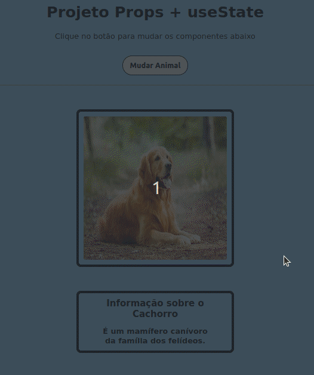

# Aplicação React com Props e useState

Esta é uma aplicação React que utiliza os hooks **'useState'** e **'props'** para alternar entre dois componentes que exibem informações e imagens de um cachorro e de um gato.

## Prints da Aplicação

Veja abaixo um Preview da aplicação em funcionamento.

## Como utilizar

Para executar a aplicação em sua máquina local, siga os passos abaixo:

1. Faça o download ou clone o repositório em sua máquina.
2. Certifique-se de que possui o Node.js e o npm instalados em sua máquina.
3. Abra o terminal na pasta raiz do projeto.
4. Execute o comando **npm install** para instalar todas as dependências do projeto.
5. Execute o comando **npm start** para iniciar a aplicação.
6. Abra o navegador e acesse a URL **http://localhost:3000/** para visualizar a aplicação.

Caso ocorra algum erro durante a execução, certifique-se de que seguiu todos os passos corretamente e tente novamente.

## Componentes
### App.js

O componente principal **'App.js'** é responsável por renderizar a aplicação. Ele utiliza o hook **'useState'** para armazenar o tipo do animal que será exibido nos componentes **'CardAnimal'** e **'CardInformacoes'**. O componente **'Topo'** é renderizado acima dos outros componentes e possui um botão que alterna entre os tipos de animais. Por fim, os componentes **'CardAnimal'** e **'CardInformacoes'** são renderizados de acordo com o tipo de animal selecionado.

### Topo

O componente **'Topo'** exibe um título e uma descrição, além de um botão que permite alternar entre os componentes **'CardAnimal'** e **'CardInformacoes'**. O botão é uma propriedade que recebe uma função de alteração de estado.

### CardInformacoes

O componente **'CardInformacoes'** exibe informações sobre o animal selecionado. Ele utiliza uma estrutura condicional para verificar qual animal foi selecionado e renderizar as informações corretas. As informações são passadas para o componente através das props.

### CardAnimal

O componente **'CardAnimal'** exibe uma imagem do animal selecionado. Ele também utiliza uma estrutura condicional para verificar qual animal foi selecionado e renderizar a imagem correta. A imagem é passada para o componente através das props.

## Conclusão

Essa aplicação React utiliza os hooks **'useState'** e **'props'** para criar uma aplicação simples que alterna entre dois tipos de animais. É possível utilizar essa aplicação como base para projetos mais complexos que utilizam esses hooks para gerenciar estados e passar informações entre componentes.